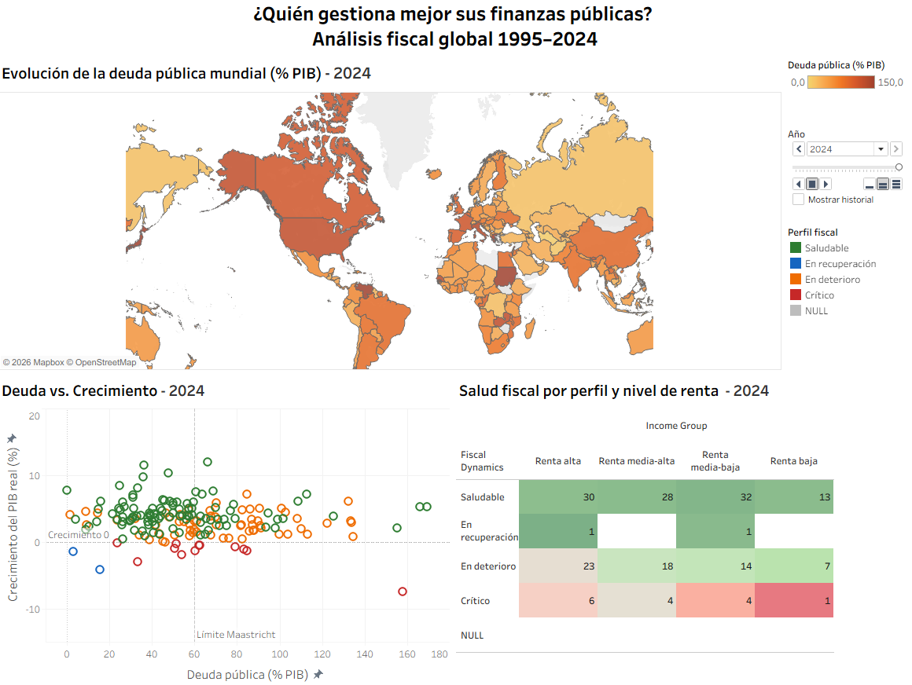
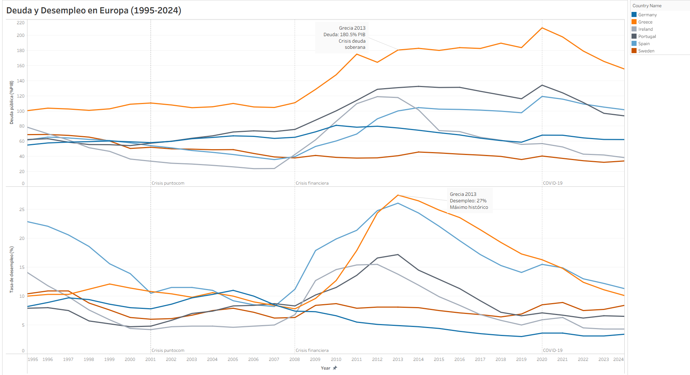

# ¿Quién gestiona mejor sus finanzas públicas?

Un análisis exploratorio de 30 años de datos fiscales del FMI (1995–2024)
para intentar responder una pregunta: **¿hay patrones reales detrás de la
"buena gestión" fiscal, o es sobre todo relato político?**

## Qué hay aquí

- `analisis_fiscal_fmi.ipynb` - el notebook con todo el proceso: descarga,
  limpieza, métricas propias, auditoría de calidad del dato y primeras
  visualizaciones exploratorias.
- `src/utils.py` - funciones reutilizables (descarga de la API del FMI,
  normalización de indicadores, clasificación de dinámica fiscal).
- `data/` - datasets exportados en CSV, listos para usar en Tableau /
  Flourish o para volver a cargar sin repetir la descarga.
- `figures/` - visualizaciones de auditoría de calidad del dato,
  generadas por el propio notebook.
- `dashboard/` - el workbook de Tableau y el vídeo del ranking animado.

## Fuentes de datos

- **IMF DataMapper API** - indicadores fiscales y macroeconómicos
  (deuda, déficit, crecimiento, desempleo) para 190+ países, gratuita
  y sin necesidad de registro.
- **World Bank `CLASS.xlsx`** - clasificación oficial de países por
  región y nivel de renta.

## Qué se construye

Además de los indicadores crudos del FMI, el análisis genera tres
métricas propias:

| Métrica | Qué mide |
|---|---|
| `debt_category` | Nivel de deuda según el umbral del 60% de Maastricht |
| `fiscal_dynamics` | Si un país está en una dinámica fiscal saludable, en deterioro, en recuperación o crítica |
| `fiscal_health_score` | Índice 0–100 que combina deuda, déficit y crecimiento |
| `vulnerability_score` | Cuántos factores de riesgo (deuda, déficit, estancamiento, desempleo) coinciden a la vez en un país-año |

## Ver el dashboard

   



- [Análisis fiscal global - mapa, scatter y matriz de riesgo](https://public.tableau.com/views/ViszQ1Q2yQ3/Anlisisfiscalglobal)
- [Austeridad vs. desempleo - series temporales](https://public.tableau.com/views/ViszQ1Q2yQ3/AusteridadvsDesempleo)
- [Ranking de salud fiscal 1995–2024 - bar chart race](https://public.flourish.studio/visualisation/29339906/)

## Cómo reproducirlo

```bash
pip install -r requirements.txt
jupyter notebook analisis_fiscal_fmi.ipynb
```

> **Importante:** ejecuta Jupyter desde la raíz del proyecto (donde está
> este README), no desde dentro de una subcarpeta. El notebook importa
> funciones desde `src/utils.py` usando una ruta relativa a la raíz —
> si abres el notebook desde otro sitio, el import fallará.

El notebook descarga los datos directamente de las APIs del FMI y del
Banco Mundial, así que necesita conexión a internet la primera vez que
se ejecuta.

## Nota de seguridad

La descarga del archivo `CLASS.xlsx` del Banco Mundial usa
`verify=False` porque su certificado SSL estaba caducado en el
momento de desarrollar este proyecto. Antes de ejecutar el notebook,
comprueba si el certificado ya está renovado, en caso afirmativo, quita
`verify=False` de esa celda.

## Resultados y hallazgos

Los datos crudos mienten por omisión: el desempleo solo estaba
disponible para 108 de los 182 países del dataset. Separar los datasets
en dos versiones evitó conclusiones incorrectas por comparar países que
en realidad no eran comparables.

El hallazgo que más rompe con la intuición: ser un país rico no implica
gestionar bien las finanzas públicas. En 2024 hay 6 economías de renta
alta en situación fiscal crítica, y el ranking histórico de salud fiscal
(1995–2024) nunca lo dominan las grandes economías del G7. Comparando a
Alemania con Grecia queda claro, además, que el *cómo* se ajusta una
economía pesa tanto como el ajuste en sí: mismo objetivo de reducir
deuda, una década de diferencia en recuperar el empleo.

Las métricas propias del proyecto (`fiscal_health_score`,
`fiscal_dynamics`, `vulnerability_score`) permiten aterrizar estas
conclusiones en números concretos, y el *linking & brushing* del
dashboard —cruzar el mapa, el scatter y la matriz de riesgo— fue lo
que hizo visible el hallazgo sobre los países ricos: en una tabla
estática habría pasado desapercibido.
